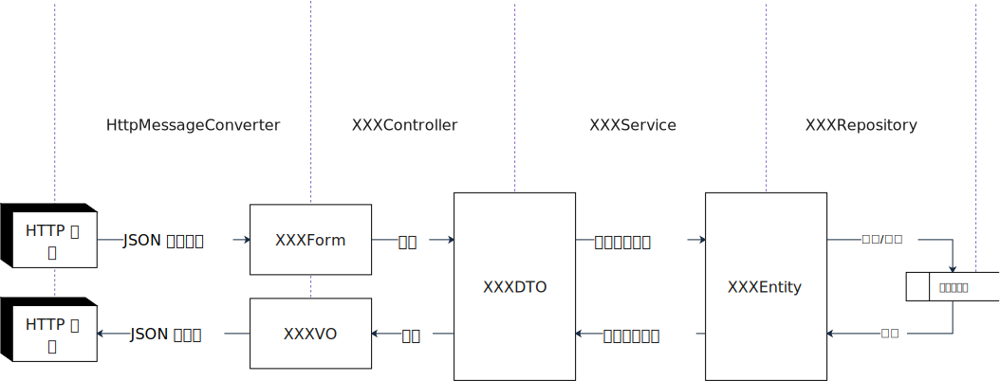

# springboot-restapi-template
一个通用的 Spring Boot RESTFul API 工程模板，包含了统一异常处理，信息国际化显示，SnowFlake 生成 ID 等通用功能。并通过一个示例来展示相应的功能。

## API 调用执行流程

一个一般的 API 请求处理过程如下图所示。



+ SpringBoot 通过 HttpMessageConverter 自动将 HTTP （POST）请求 Body 反序列化为一个 XXXForm 对象
+ XXXController 对请求的内容进行校验，包括 XXXFrom 对象和请求查询参数等
+ 通过校验的请求被包装称为一个 XXXDTO 对象，目的是方便进行业务处理
+ XXXService 进行业务处理，并将要持久化的数据放到实体类 XXXEntity 对象中
+ XXXRepositoy （ORM 框架）将实体类对象保存到数据库中
+ 如果是查询请求，则 XXXRepository 从数据库中取出记录放到实体类对象中
+ XXXService 进行业务处理，并返回一个 XXXDTO 给 XXXController
+ XXXController 将 XXXDTO 转化为 XXXVO（一般是过滤了部分不想给前端看到的字段）
+ HttpMessageConverter 自动将 XXXVO 序列化为 HTTP 响应的 Body。

> **DTO** : Data Transfer Object；
> **VO** : View Object

上述请求过程仅提供一个参考，实际在写代码时应该具体问题具体分析。

## 包结构
```$xslt
├───src
│   ├───main
│   │   ├───java
│   │   │   └───site
│   │   │       └───luofuxiang
│   │   │           ├───configuration       Spring @Configuration 相关类
│   │   │           ├───context             应用程序上下文相关类
│   │   │           ├───controller          控制器
│   │   │           │   └───handler         统一异常处理器
│   │   │           ├───entity              实体类
│   │   │           │   └───converter       实体类字段与数据库字段转换器
│   │   │           ├───enums               枚举类
│   │   │           ├───exception           自定义异常
│   │   │           ├───form                表单，对应用户提交的数据
│   │   │           │   └───validator       自定义校验器，对相应的表单进行校验
│   │   │           ├───repository          Jap 操作相关类
│   │   │           ├───service             Service 层相关类和接口
│   │   │           │   └───impl            Service 层相关接口的实现类
│   │   │           ├───util                放工具类
│   │   │           └───vo                  放 XXXVO，对应于返回给用户的数据
│   │   └───resources                       放配置文件和资源文件
│   │       └───i18n                        国际化消息文件
│   └───test                                
│       └───java                            放单元测试的 java 代码
```

## 示例

模板中提供了一个示例 API。通过 API 可以对部门、员工进行查询，插入，修改操作。

API 请求已经发布在 Postman 中，可以[点击这里](https://documenter.getpostman.com/view/4063098/TVmQdvd6)查看并直接导入到 Postman 中运行。 

